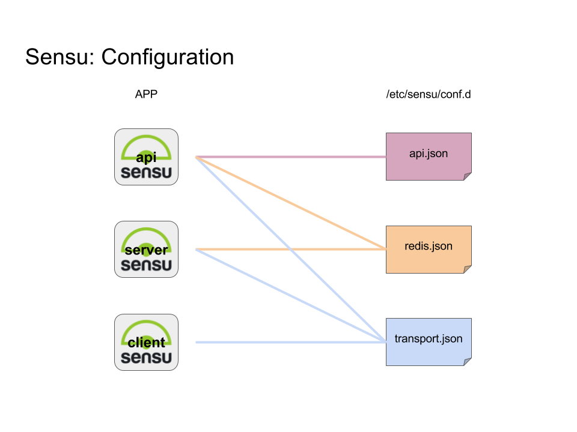

# Distributed Sensu monitoring stack via docker-compose

## Pre-requisites

* docker-engine
* docker-compose
* openssl

## Architecture

### Elements

* Sensu
    * sensu-server (core)
    * sensu-api
    * sensu-client
    * sensu-dashboard (uchiwa)
* Transport
    * RabbitMQ
* Datastore
    * Redis

## Commands

* Create & start: `./create_stack.sh`
* Start: `./start_stack.sh`
* Stop: `./stop_stack.sh`
* Teardown: `./teardown_stack.sh`
* Add client: `./add_client.sh`

## Access

* username: admin
* password: secret

## Configuration

## SSL

* Run `./ssh_tool.sh` to get the SSL certificates

## Reference Documentation

* Sensu configuration: https://sensuapp.org/docs/latest/reference/configuration.html
* Uchiwa configuration: https://docs.uchiwa.io/getting-started/configuration/#uchiwa-configuration
* Uchiwa docker: https://hub.docker.com/r/uchiwa/uchiwa/

## Sensu Flow

