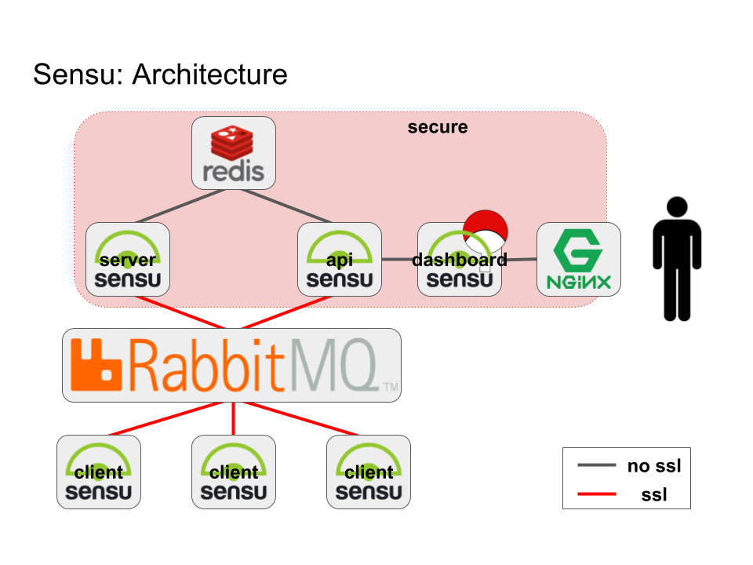

# NOT STABLE - Distributed Sensu monitoring stack via docker-compose

## Next steps

* add nginx container
* add graphs: https://blog.powerupcloud.com/step-by-step-install-and-configure-sensu-grafana-9cedca333396

## Architecture

## Elements

* Sensu
  * sensu-server (core)
  * sensu-api
  * sensu-client
  * sensu-dashboard (uchiwa)
* Transport
  * RabbitMQ
* Datastore
  * Redis

## Reference Documentation

* Sensu configuration: https://sensuapp.org/docs/latest/reference/configuration.html
* Uchiwa configuration: https://docs.uchiwa.io/getting-started/configuration/#uchiwa-configuration
* Uchiwa docker: https://hub.docker.com/r/uchiwa/uchiwa/

## Sensu Flow

