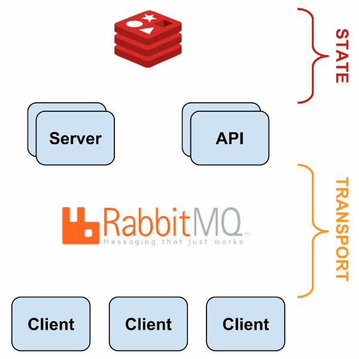

# NOT STABLE - Distributed Sensu monitoring stack via docker-compose

# ADDING

1. Graphite Carbon cache
2. Whisper library ddbb
3. MySQL ddbb
4. Graphite web
5. Grafana

* following: https://blog.powerupcloud.com/step-by-step-install-and-configure-sensu-grafana-9cedca333396

## Architecture

## Elements

* Sensu
  * sensu-server (core)
  * sensu-api
  * sensu-client
  * sensu-dashboard (uchiwa)
* Transport
  * RabbitMQ
* Datastore
  * Redis

## Pre-requisites

* docker-engine
* docker-compose
* openssl
* Run `./ssh_tool.sh` to get the SSL certificates

## Run

* Run: `docker-compose up -d`

## Reference Documentation

* Sensu configuration: https://sensuapp.org/docs/latest/reference/configuration.html
* Uchiwa configuration: https://docs.uchiwa.io/getting-started/configuration/#uchiwa-configuration
* Uchiwa docker: https://hub.docker.com/r/uchiwa/uchiwa/

## Sensu Flow

